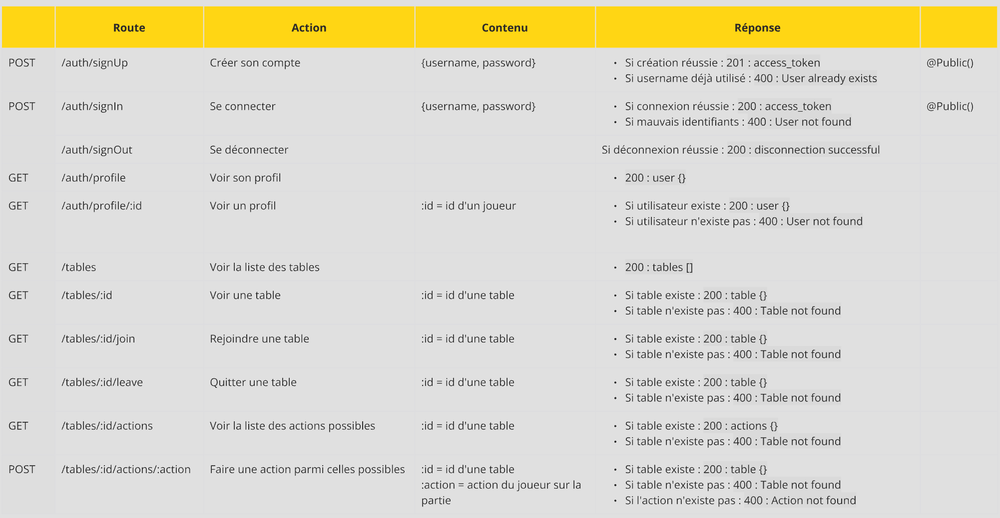

# API POKER

## Sommaire
- [Description](#description)
- [Technologies utilisées](#technologies-utilisées)
- [Installation et démarrage](#installation-et-démarrage)
- [Routes de l'API](#routes-de-lapi)
- [Fonctionnalités](#fonctionnalités)
- [Auteurs](#auteurs)

## Description

Ce projet est une API de poker développée en duo dans le cadre de notre formation chez MyDigitalSchool. L'API permet de simuler des parties, les joueurs et les mises, tout en respectant les règles du texas holdem. Ce projet s'inscrit dans le cadre du cours de Développement API.

## Technologies utilisées
Ce projet utilise les technologies suivantes :

- **NestJS**
- **SQLite**
- **Swagger**

## Installation et démarrage

### ⚠️⚠️ Ce projet fonctionne de paire avec le front. Il est recommandé d'installer ce projet en conteneur via le repo : 

```https://github.com/MDS-poker-project/poker-tools```

### 1. Prérequis
Avant l'installation, assurez-vous d'avoir les éléments suivants :
- Node.js
- npm

### 2. Clonez le projet :

```bash
$ git clone https://github.com/MDS-poker-project/Poker-API.git
```

### 3. Installez les dépendances
```bash
$ npm install
```

### 4. Lancer l'application
```bash
$ npm run start:dev
```

## Routes de L'API




## Fonctionnalités

- Créer un compte joueur
- Se connecter
- Se déconnecter
- Voir un profil
- Voir la liste des tables
- Voir le détail d'une table
- Rejoindre une table
- Quitter une table
- Voir la liste des actions possibles lors d'une partie
- Lancer une action sur la table rejointe
- Trouver de l'argent

## Auteurs
- Pazhang Behnood
- Boutrois Benjamin